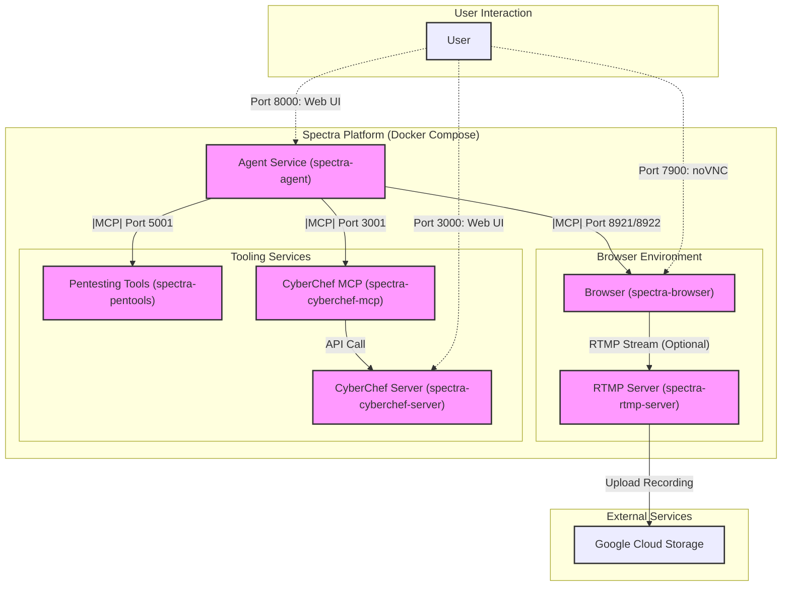
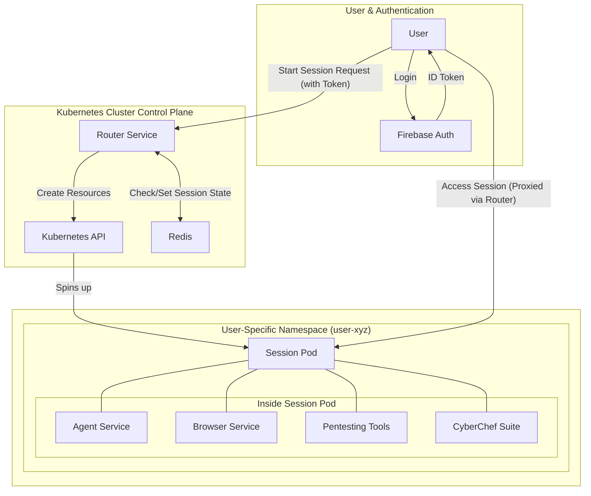

# Spectra

[](https://github.com/nishithp2004/spectra/actions/workflows/build.yml)
[](https://www.docker.com/)
[](https://github.com/google/adk-python)

Spectra is a powerful, distributed platform for orchestrating AI agents to perform complex digital tasks. It leverages a modular, microservices-based architecture to provide sandboxed environments for web browsing, UI automation, data manipulation, and penetration testing. Agents communicate and coordinate through the Model Context Protocol (MCP), enabling sophisticated, multi-step task execution.

The platform supports two primary deployment models:
1.  **Docker Compose:** A local, all-in-one setup perfect for development, testing, and single-user instances.
2.  **Kubernetes:** A scalable, multi-user architecture where a central router dynamically provisions isolated, on-demand session environments for each user.

## ✨ Features

*   **AI-Powered Orchestration:** Utilizes a hierarchy of LLM-based agents (Planner, Clicker, CyberChef, Pentest) for intelligent task decomposition and execution.
*   **Modular Microservices:** Composed of specialized, containerized services for browsing, pentesting, data manipulation, and session recording.
*   **Isolated Browser Environments:** Provides remote-controlled Chrome browser sessions accessible via noVNC and automated through Playwright via MCP.
*   **Integrated Pentesting Toolkit:** Offers a suite of Kali Linux tools (Nmap, SQLMap, GoBuster, etc.) accessible to agents via a dedicated MCP interface.
*   **CyberChef Integration:** Includes a built-in CyberChef instance for versatile data manipulation, exposed to agents for automated use.
*   **Dynamic K8s Session Management:** A Node.js router can dynamically spin up and tear down complete, isolated user session pods on a Kubernetes cluster.
*   **Session Recording & Streaming:** Optional RTMP-based recording of browser sessions, with automated uploads of finished recordings to Google Cloud Storage.
*   **Extensible Agent Framework:** Built on Google's Agent Development Kit (ADK), allowing for easy extension with new agents and capabilities.

## 🏗️ Architecture Overview

Spectra is a collection of services that work in concert. In a local setup, they are orchestrated by `docker-compose`, while in a scalable deployment, they are managed by Kubernetes.

**Core Services:**

*   **Agent Service (`agent`):** The central brain hosting the LLM agents. It plans tasks and delegates execution to the appropriate tool or sub-agent via MCP.
*   **Browser Service (`browser`):** An isolated Chrome browser with noVNC access. It runs MCP servers for Playwright and PyAutoGUI, allowing for robust UI automation.
*   **Pentesting Tools Service (`pentools`):** A Kali Linux environment that exposes security tools to agents via a Flask API and an MCP server.
*   **CyberChef Service (`cyberchef`):** Provides the CyberChef web UI and an MCP server, making its data manipulation functions available to agents.
*   **RTMP Server (`rtmp-server`):** (Optional) An Nginx-based server that receives and records video streams from browser sessions, uploading them to GCS.

**Kubernetes-Specific Services:**

*   **Router (`router`):** The entry point and orchestrator for the Kubernetes deployment. It handles user authentication (via Firebase) and dynamically creates/destroys isolated session pods for each user.
*   **Redis (`redis`):** A state store used by the Router to manage active user sessions.

## 🧩 Components

| Service                 | Description                                                                                                                                  | Technology Stack                                                | Ports (in `docker-compose`)                            |
| ----------------------- | -------------------------------------------------------------------------------------------------------------------------------------------- | --------------------------------------------------------------- | ------------------------------------------------------ |
| **Agent Service**       | The core orchestration engine. Hosts the Planner, Clicker, CyberChef, and Pentest agents.                                                    | Python, Google ADK, FastAPI, Poetry                             | `8000` (Web UI/API)                                    |
| **Browser Service**     | Provides a sandboxed browser environment with remote access and automation hooks.                                                            | Selenium/Chrome, noVNC, Playwright, PyAutoGUI, Node.js, FFmpeg  | `7900` (noVNC), `8921` (Playwright MCP), `8922` (PyAutoGUI MCP) |
| **Pentesting Tools**    | A Kali Linux container exposing security tools.                                                                                              | Kali Linux, Python, Flask, FastMCP                              | `5000` (API), `5001` (MCP)                             |
| **CyberChef Server**    | Hosts the CyberChef web interface ("The Cyber Swiss Army Knife").                                                                            | Node.js, CyberChef                                              | `3000` (Web UI)                                        |
| **CyberChef MCP**       | Exposes CyberChef's data manipulation functions to the agent system via MCP.                                                                 | Python, FastMCP                                                 | `3001` (MCP)                                           |
| **RTMP Server**         | (Optional) Receives, records, and uploads browser session video streams.                                                                     | Nginx-RTMP, Node.js (for GCS upload)                            | `1935` (RTMP), `8080` (Web Interface)                  |
| **Router**              | (K8s) Orchestrates user sessions on Kubernetes. Not used for core agent logic in `docker-compose`.                                           | Node.js, Express, Kubernetes Client                             | `80` (Main Entrypoint)                                 |
| **Redis**               | (K8s) A key-value store used by the Router to track active sessions.                                                                         | Redis                                                           | `6379`                                                 |

### Interactive Architecture Diagrams

Below are diagrams illustrating the two primary deployment architectures for Spectra.

#### Local Docker Compose Setup

This diagram shows the relationships between services when running locally with `docker-compose`. Each node is clickable and will take you to the relevant component description.



#### Scalable Kubernetes Setup

This diagram illustrates the high-level architecture for a multi-user deployment on Kubernetes. The `Router` service dynamically provisions isolated session environments for each authenticated user.



## 🚀 Getting Started (Local Development with Docker Compose)

This setup runs all core services on your local machine and is ideal for development and testing.

### Prerequisites

*   [Docker](https://docs.docker.com/get-docker/)
*   [Docker Compose](https://docs.docker.com/compose/install/)
*   [Git](https://git-scm.com/)

### Configuration

1.  **Clone the Repository:**
    ```bash
    git clone --recurse-submodules https://github.com/nishithp2004/spectra.git
    cd spectra
    ```

2.  **Set up Agent Environment:**
    Copy the sample environment file and fill in your API keys.
    ```bash
    cp agents/.env.sample agents/.env
    ```
    Edit `agents/.env` and add your `GOOGLE_API_KEY`. The other `MCP_TOOLS_URL_*` variables are pre-configured for Docker Compose networking.

3.  **Set up GCS Upload (Optional):**
    If you want to record browser sessions and upload them to Google Cloud Storage:
    *   Create a GCS bucket and a service account with "Storage Object Creator" permissions.
    *   Download the service account's JSON key file.
    *   Place the key file at `./rtmp-server/credentials.json`.
    *   In `docker-compose.yaml`, set the `ENABLE_RECORDING` environment variable for the `browser` service to `true`.
    *   Create a `.env` file in the `rtmp-server` directory and specify your `GCS_BUCKET_NAME`.

### Running the Project

1.  **Build and Run Services:**
    From the root directory, run:
    ```bash
    docker-compose up -d --build
    ```
    The `--build` flag ensures images are built from the latest source. The `-d` flag runs containers in the background.

2.  **View Logs:**
    To see the logs for all services:
    ```bash
    docker-compose logs -f
    ```
    To follow logs for a specific service (e.g., `agent`):
    ```bash
    docker-compose logs -f agent
    ```

3.  **Stop Services:**
    ```bash
    docker-compose down
    ```
    To also remove volumes (like persistent agent data), use `docker-compose down -v`.

### Accessing Services

Once running, you can access the services on `localhost`:

*   **Spectra Agent UI:** `http://localhost:8000`
*   **Browser (noVNC):** `http://localhost:7900`
*   **CyberChef UI:** `http://localhost:3000`
*   **Pentesting Tools API:** `http://localhost:5000/health`
*   **RTMP Stream Player:** `http://localhost:8080`

## ☸️ Kubernetes Deployment

For a scalable, multi-user environment, Spectra uses a Kubernetes-based architecture orchestrated by the **Router** service.

*   **How it Works:** The router is the main entry point. Upon user authentication (via Firebase), it uses the Kubernetes API to dynamically create a new namespace and a dedicated `session-pod` for that user. This pod contains all the necessary services (agent, browser, tools) for an isolated session.
*   **Manifests:**
    *   The `k8s/` directory contains the manifests required to deploy the router itself, its service account (`router-sa`), roles (`cluster-role.yaml`), and the Redis dependency.
    *   The `router/templates/` directory contains the YAML templates (`session-pod.yaml`, `rtmp-pod.yaml`, etc.) that the router uses to create the per-user environments.
*   **State Management:** The router uses Redis to track active user sessions, namespaces, and credentials.
*   **Cleanup:** When a session ends, the router can trigger a cleanup job to tear down the user's namespace and associated resources.

This model allows multiple users to run concurrent, fully isolated Spectra sessions without interference.

## Kubernetes Setup

1.  **Prerequisites:**
    *   A running Kubernetes cluster (Google Kubernetes Engine).
    *   `kubectl` configured to communicate with your cluster.

2.  **Configuration Files:**
    The router requires credentials to connect to Firebase (for authentication) and Redis (for session state).

    *   **Firebase Credentials:** Create a service account in your Firebase project and download the JSON key. Place it at `router/credentials.json`.

    *   **Environment Variables:** Create a file named `router/.env` with your Redis connection details. It should look like this:
        ```bash
        # router/.env
        REDIS_HOST=redis-svc.default.svc.cluster.local
        REDIS_PORT=6379
        REDIS_USERNAME=default
        # Set a password if your Redis deployment requires one
        # REDIS_PASSWORD=your-secure-password
        ```

3.  **Create Kubernetes Secrets:**
    These commands package your configuration files into Kubernetes secrets, which can be securely mounted into the router pod.
    ```bash
    # Create a secret for Firebase credentials
    kubectl create secret generic spectra-secret \
      --from-file=router/credentials.json \
      --namespace=default

    # Create a secret from the .env file for Redis and other settings
    kubectl create secret generic spectra-env-secret \
      --from-env-file=router/.env \
      -n default
    ```

4.  **Deploy Core Services:**
    Apply the Kubernetes manifests to deploy the Redis instance, the router, and its required RBAC roles.
    ```bash
    kubectl apply -f k8s/
    ```

5.  **Verify Deployment:**
    Check that the pods are running and find the external IP address for the `router-service`.
    ```bash
    kubectl get pods
    kubectl get service router-service
    ```
    You can now access the Spectra router via the `EXTERNAL-IP` of the `router-service`.

## 🛠️ Development

*   **Modular Design:** Each directory (`agents`, `browser`, etc.) is a self-contained application.
*   **Rebuilding:** You can work on a single service and rebuild it without affecting others:
    ```bash
    docker-compose up -d --build <service_name>
    # Example: docker-compose up -d --build agent
    ```
*   **Dependencies:**
    *   `agents`: Managed with Poetry (`agents/pyproject.toml`).
    *   `tools/pentools`: Managed with `pip` (`tools/pentools/requirements.txt`).
    *   `router`, `rtmp-server`, `browser`: Managed with `npm` (`package.json`).

## 🔄 CI/CD

The `.github/workflows/build.yml` workflow automates the process of building and pushing Docker images for all services to Docker Hub upon changes to the `main` branch. This ensures that the `latest` tag always points to the most up-to-date version of each component.